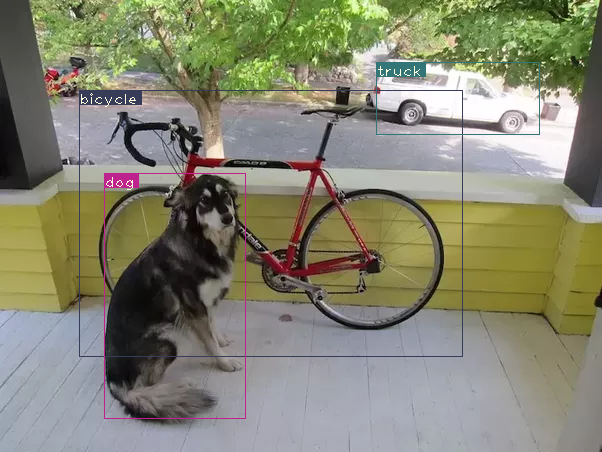

# YOLOv3

A simple PyTorch implementation of YOLOv3 I wrote to learn about its architecture. Only supports object inference.

The YOLOv3 object detection algorithm is based on [Joseph Redmon and Ali Farhadi’s famous paper](https://pjreddie.com/media/files/papers/YOLOv3.pdf), while a lot of the code and structure here is based on [Ayoosh Kathuria’s YOLOv3 blog series](https://blog.paperspace.com/how-to-implement-a-yolo-object-detector-in-pytorch/). YOLO config files and weights are again from [Joseph Redmon](https://pjreddie.com/darknet/yolo/) himself. 

## Usage

Currently, this implementation only supports running YOLOv3 on image files. Simply navigate into this directory and run
```
./yolo --images <location of image> --det <destination directory>
```
which will run YOLOv3 on the specified images, then save the processed images in the destination directory.

<p align="center">
  
  <div align="center">
    Example output using this implementation.
  </div>
</p>

By default, this implementation uses Joseph Redmon's YOLOv3 weights, trained on the COCO dataset. You can specify your own config file, weights file, and names file, using the `--cfg`, `--weights`, and `--names` flags respectively. You can also optionally use the `--bs`, `--confidence`, `-nms_thresh`, and `--reso` flags to specify the respective parameters as desired (use the `-h` flag for usage details).
